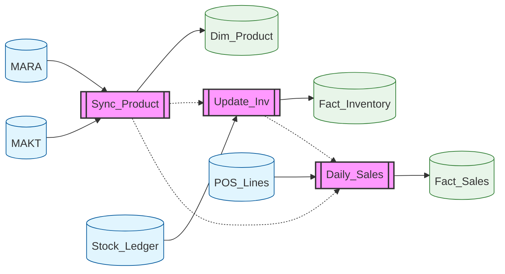

```mermaid
graph LR
    classDef job fill:#f9f,stroke:#333,stroke-width:2px;
    classDef source fill:#e1f5fe,stroke:#01579b;
    classDef target fill:#e8f5e9,stroke:#2e7d32;
    MARA[(MARA)]:::source --> ETL_MD_01[[ Sync_Product ]]:::job
    MAKT[(MAKT)]:::source --> ETL_MD_01[[ Sync_Product ]]:::job
    ETL_MD_01 --> Dim_Product[(Dim_Product)]:::target
    Stock_Ledger[(Stock_Ledger)]:::source --> ETL_INV_02[[ Update_Inv ]]:::job
    ETL_INV_02 --> Fact_Inventory[(Fact_Inventory)]:::target
    ETL_MD_01 -.-> ETL_INV_02
    POS_Lines[(POS_Lines)]:::source --> ETL_SLS_03[[ Daily_Sales ]]:::job
    ETL_SLS_03 --> Fact_Sales[(Fact_Sales)]:::target
    ETL_MD_01 -.-> ETL_SLS_03
    ETL_INV_02 -.-> ETL_SLS_03
```
