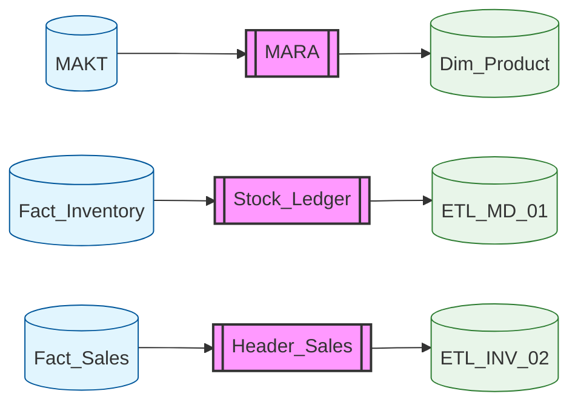

```mermaid
graph LR
    classDef job fill:#f9f,stroke:#333,stroke-width:2px;
    classDef source fill:#e1f5fe,stroke:#01579b;
    classDef target fill:#e8f5e9,stroke:#2e7d32;
    MAKT[(MAKT)]:::source --> Sync_Product[[ MARA ]]:::job
    Sync_Product --> Dim_Product[(Dim_Product)]:::target
    Fact_Inventory[(Fact_Inventory)]:::source --> Update_Inv[[ Stock_Ledger ]]:::job
    Update_Inv --> ETL_MD_01[(ETL_MD_01)]:::target
    Fact_Sales[(Fact_Sales)]:::source --> Daily_Sales[[ Header_Sales ]]:::job
    Daily_Sales --> ETL_INV_02[(ETL_INV_02)]:::target
```
