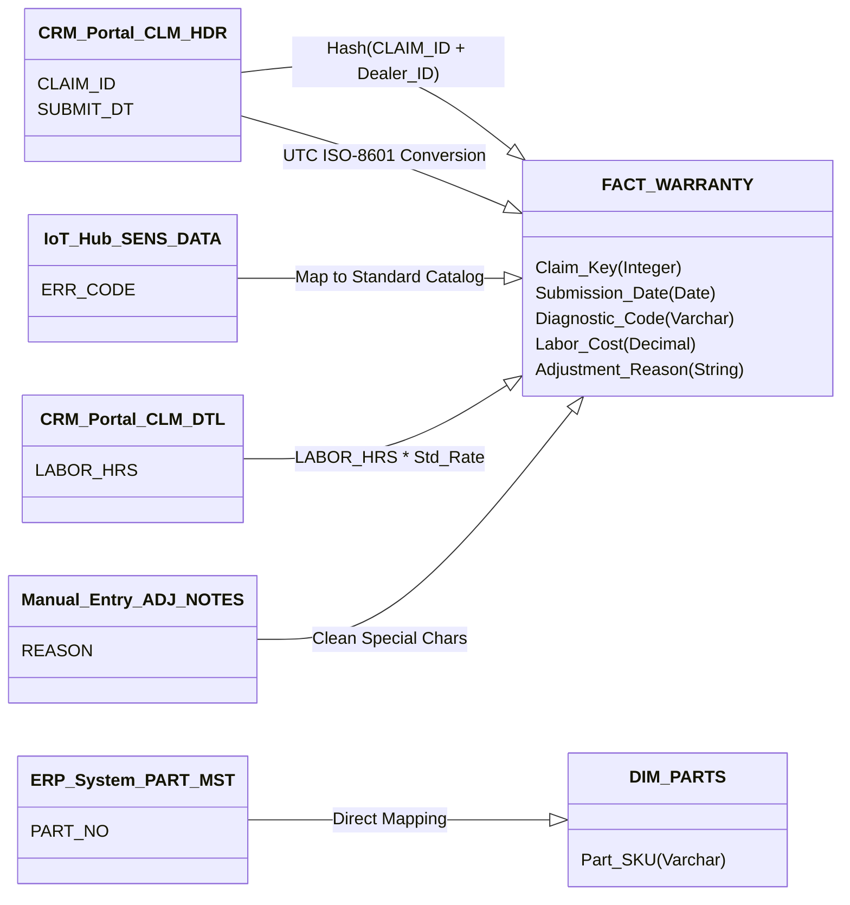

```mermaid
classDiagram
    direction LR

    %% Source Systems
    class CRM_Portal_CLM_HDR {
        CLAIM_ID
        SUBMIT_DT
    }

    class ERP_System_PART_MST {
        PART_NO
    }

    class IoT_Hub_SENS_DATA {
        ERR_CODE
    }

    class CRM_Portal_CLM_DTL {
        LABOR_HRS
    }

    class Manual_Entry_ADJ_NOTES {
        REASON
    }

    %% Target Tables
    class FACT_WARRANTY {
        Claim_Key (Integer)
        Submission_Date (Date)
        Diagnostic_Code (Varchar)
        Labor_Cost (Decimal)
        Adjustment_Reason (String)
    }

    class DIM_PARTS {
        Part_SKU (Varchar)
    }

    %% Relationships & Transformations
    CRM_Portal_CLM_HDR --|> FACT_WARRANTY : Hash(CLAIM_ID + Dealer_ID)
    CRM_Portal_CLM_HDR --|> FACT_WARRANTY : UTC ISO-8601 Conversion
    ERP_System_PART_MST --|> DIM_PARTS : Direct Mapping
    IoT_Hub_SENS_DATA --|> FACT_WARRANTY : Map to Standard Catalog
    CRM_Portal_CLM_DTL --|> FACT_WARRANTY : LABOR_HRS * Std_Rate
    Manual_Entry_ADJ_NOTES --|> FACT_WARRANTY : Clean Special Chars
```
