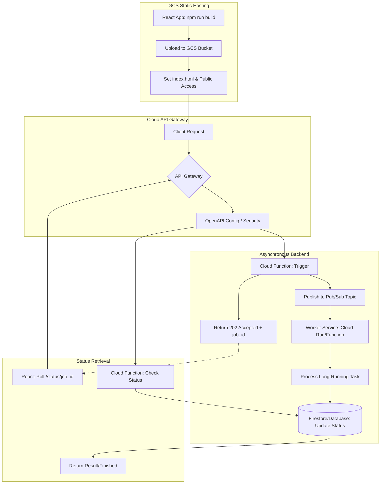

```mermaid
graph TD
    %% Frontend Deployment
    subgraph Frontend_Hosting [GCS Static Hosting]
        A[React App: npm run build] --> B[Upload to GCS Bucket]
        B --> C[Set index.html & Public Access]
    end

    %% API Layer
    subgraph API_Management [Cloud API Gateway]
        D[Client Request] --> E{API Gateway}
        E --> F[OpenAPI Config / Security]
    end

    %% Async Backend Logic
    subgraph Async_Processing [Asynchronous Backend]
        F --> G[Cloud Function: Trigger]
        G --> H[Return 202 Accepted + job_id]
        G --> I[Publish to Pub/Sub Topic]
        I --> J[Worker Service: Cloud Run/Function]
        J --> K[Process Long-Running Task]
        K --> L[(Firestore/Database: Update Status)]
    end

    %% Feedback Loop
    subgraph Results_Polling [Status Retrieval]
        H -.-> M[React: Poll /status/job_id]
        M --> E
        F --> N[Cloud Function: Check Status]
        N --> L
        L --> O[Return Result/Finished]
    end

    C --- D
```
