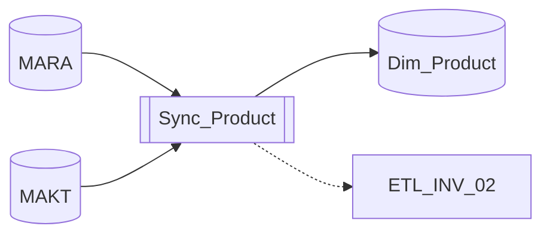

```mermaid
graph LR
    MARA[(MARA)]:::source --> ETL_MD_01[[ Sync_Product ]]:::job
    MAKT[(MAKT)]:::source --> ETL_MD_01[[ Sync_Product ]]:::job
    ETL_MD_01 --> Dim_Product[(Dim_Product)]:::target
    ETL_MD_01 -.-> ETL_INV_02
```
