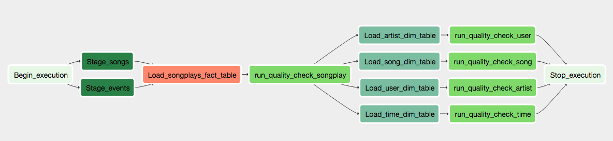

## Project Summary 
Sparkify wants to analyze the data they've been collecting on songs and user activity on their new music streaming app.Currently they have data in JSON files but its diffcult for data analysts to work on JSON files.Sparkify wants to move there data into a data warehouse(Redshift).They want to build a ETL pipeline using some visual tool and we have selected Apache Airflow for that because Airflow has options to develop DAG based flows.We will be builing a single flow in Airflow to load staging data from s3 to redshift staging tables and then load that data from staging to Fact and dimensions.

## Summary of Sparkify Data pipeline build in Airflow
Our pipeline mainly consist of following three operations
1. Load data from s3 to redshift that will include loading both songs data and events data.
2. Load Facts and dimensions from Staging tables via provided sql queries.
3. Perform Data Quality Checks on final Facts and dimensions.

## Source Data Location
The log data is located at s3://udacity-dend/log_data and the song data is located in s3://udacity-dend/song_data

## Airflow Project Details
Project template include single DAG file and four Operators and details of each of them is as below.
### DAG File Details(Load_Data_Dag)
Please see the screenshot below for details of main dag of project

## Execution instructions
### Prerequsite
You need to have redshift instance in AWS and update dwh.cfg file with db details and role. 
You need to have python installed on the system on which you are running the scripts
### Steps to execute
1. Open cli and go to the project folder.
2. Run create tables python file using following command
    python create_tables.py
3. Run ETL python file using the following command.This step will first load data in staging tables and then load that data using sql scripts to facts and dimensions.
    python etl.py
    
4. your data is loaded.

## Repository Details
1. sql_queries.py contains all the queries that we will be running in etl.py and create_tables.py.
4. create_tables.py this file will drop the existing tables and then create the new ones.
5. etl.py will load data from JSON files to staging tables using redshit copy command and then will load the data to facts and dimensions using sql based ETL's.