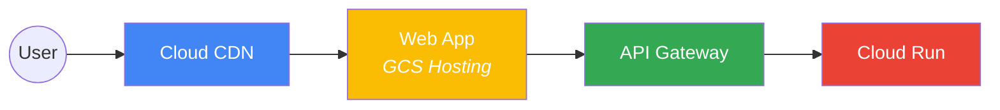

```mermaid
graph LR
    User((User)) --> CDN[Cloud CDN]
    CDN --> WebApp[Web App <br/> <i>GCS Hosting</i>]
    WebApp --> APIGW[API Gateway]
    APIGW --> CloudRun[Cloud Run]

    style CDN fill:#4285F4,color:#fff
    style WebApp fill:#FBBC04,color:#fff
    style APIGW fill:#34A853,color:#fff
    style CloudRun fill:#EA4335,color:#fff


```
